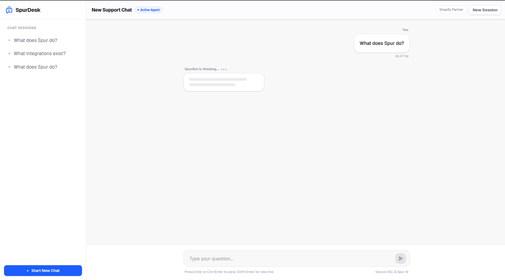
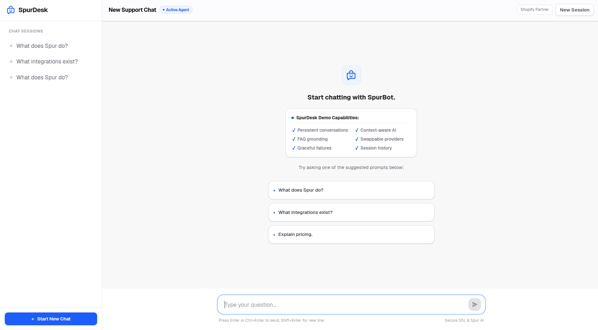

# SpurDesk - AI-Powered Customer Support Platform

SpurDesk is a modular AI-powered customer support platform designed to simulate a modern live support experience while demonstrating scalable backend architecture and clean engineering practices. An AI agent, powered by **Gemini 2.5 Flash**, answers user questions using real-time store policy documentation fetched dynamically from a database-driven Knowledge Base.

> [!NOTE]
> For a deep-dive into the backend service patterns, request pipelines, caching logic, error retries, and future scaling plans, please refer to the detailed **[Technical Architecture & Engineering Decisions](./documentation/architecture_and_decisions.md)**.

## Live Demo
- **Frontend**: [https://assist-flow-ten.vercel.app](https://assist-flow-ten.vercel.app)
- **Backend API**: [https://assistflow-mtk9.onrender.com](https://assistflow-mtk9.onrender.com)

## Preview



---

## 1. Overview
SpurDesk simulates the foundational architecture of an automated customer engagement platform. The system is intentionally designed around modular services and provider abstractions so that additional channels (e.g., WhatsApp, Instagram, or Facebook Messenger) can be integrated with minimal changes to the conversation orchestration layer. It demonstrates:
- Persistent chat sessions that survive browser reloads.
- An extensible **LLM Provider Abstraction** designed for swapping providers (Gemini, OpenAI, Claude).
- A **Knowledge Retrieval** system that queries FAQs from a database rather than hardcoding business rules in system prompts.
- Operational design patterns suitable for a high-availability customer service environment.

## Engineering Principles
- **Thin Controllers, Rich Services**: Keep controllers slim and isolated; encapsulate business logic entirely within dedicated services.
- **Composition over Coupling**: Prefer composition and decoupled helper abstractions over tightly coupled implementations.
- **LLM as Infrastructure**: Treat LLM providers as interchangeable infrastructure (abstracted behind clean interfaces and factories).
- **Externalize Knowledge**: Keep knowledge base facts outside model prompts whenever possible to maximize context window efficiency and maintainability.
- **Graceful Failures**: Anticipate API timeouts, quota limits, and network dropouts by implementing robust try/catch fallback protections.

---

## 2. Features
- **Persisted Conversations**: Message history is written to a local database and retrieved seamlessly.
- **Dynamic Context Injection (RAG-lite)**: Identifies key policy terms in customer queries, pulls relevant answers from the DB, and injects them as facts for the AI.
- **Local Conversation Titles**: Derives a meaningful name for new sessions immediately from the user's initial question to keep latency ultra-low.
- **Operational Tracing**: Logs every API request with unique `requestId`, `sessionId`, and latency metrics.
- **Robust Input Validation**: Strict client and server-side rules preventing empty queries or spamming (trimmed and limited to 2000 characters).
- **Spur Brand Theme**: Light theme matching the official Spur design system, featuring electric blue primary accents, user chat bubbles in white with grey borders, AI bubbles in Spur Cobalt Blue, Shopify & Meta Partner badges, and a custom SVG Spur smiley-bag logo.

---

## 3. Tech Stack
- **Monorepo Structure**: Separate services for frontend and backend.
- **Frontend**: Next.js (App Router, TypeScript, Tailwind CSS v4).
- **Backend**: Node.js + Express + TypeScript.
- **Database**: SQLite (local) / PostgreSQL (production-compatible) via Prisma.
- **LLM API**: Google Gemini 2.5 Flash (via `@google/generative-ai` SDK) / Swappable OpenAI & Anthropic Claude APIs.
- **Caching**: Redis client (with automatic in-memory fallback).

---

## 4. Project Structure
```
spurdesk/
├── spurdesk-api
│   ├── controllers
│   ├── services
│   ├── repositories
│   ├── providers
│   └── middleware
│
└── spurdesk-web
    ├── app
    ├── components
    └── services
```

---

## 5. Database Schema & Seeding
Our local SQLite database operates on three models configured via Prisma:
- `Conversation`: Chat session metadata including unique `id` (UUID) and derived chat title.
- `Message`: Connects directly to the conversation. Holds `sender` (`user` | `ai`), message `text`, and timestamps. Uses indexes on `conversationId` and `createdAt` for fast chronological loading.
- `KnowledgeBase`: Stores store-policy documentation details.

### Database Seeding (`npx prisma db seed`)
Seeding is handled by `spurdesk-api/prisma/seed.ts` and populates the database with:
- **Shipping FAQ**: Detailed policies on transit times, coverage (USA/International), and rates.
- **Returns FAQ**: 30-day refund policies, conditions, and process.
- **Pricing FAQ**: Standard monthly tiers, annual discounts, and trial details.
- **Integrations FAQ**: Platforms supported including WhatsApp Business API, Facebook Messenger, Instagram, and Shopify.
- **Support Hours FAQ**: Operational schedules (Mon-Fri) and backup live support.

---

## 6. Running Locally

### Prerequisites
- Node.js (v18+)
- npm (v9+)

### Step-by-Step Instructions

1. **Install Dependencies**
   From the root folder, run:
   ```bash
   npm run install:all
   ```

2. **Configure Environment Variables**
   - Copy `.env.example` to `.env` in `spurdesk-api/`:
     ```bash
     cd spurdesk-api
     cp .env.example .env
     ```
     Configure your API keys in the generated `.env` file.
   - Copy `.env.example` to `.env` in `spurdesk-web/`:
     ```bash
     cd ../spurdesk-web
     cp .env.example .env
     cd ..
     ```

3. **Migrate & Seed the Database**
   Initialize SQLite database and seed FAQ items:
   ```bash
   cd spurdesk-api
   npx prisma migrate dev --name init
   npx prisma db seed
   cd ..
   ```

4. **Start Dev Environment**
   Run the concurrent server runner:
   ```bash
   npm run dev
   ```
   - Web App: [http://localhost:3000](http://localhost:3000)
   - API Backend: [http://localhost:3001](http://localhost:3001)

---

## 7. Environment Variables

### Backend (`spurdesk-api/.env`)
* **`GEMINI_API_KEY`**: (Optional) API key for Google Gemini model access.
* **`OPENAI_API_KEY`**: (Optional) API key for OpenAI model access.
* **`ANTHROPIC_API_KEY`**: (Optional) API key for Anthropic Claude model access.
* **`LLM_PROVIDER`**: Override provider to force a vendor choice (`gemini` | `openai` | `anthropic`). If unset, `ProviderFactory` auto-detects based on available keys.
* **`DATABASE_URL`**: DB connection URL (Default: `file:./dev.db` for SQLite).
* **`REDIS_URL`**: Redis connection URL (Default: `redis://localhost:6379` - falls back to in-memory if unreachable).
* **`PORT`**: Backend server port (Default: `3001`).

### Frontend (`spurdesk-web/.env`)
* **`NEXT_PUBLIC_API_URL`**: Base backend API url (Default: `http://localhost:3001/api`).

---

## 8. API Endpoints

### 1. `POST /api/chat/message`
Submit a support message to the AI agent. If validation passes (whitespace trimmed, message length ≤ 2000 characters), the pipeline resolves the query.
* **Request Example**:
  ```json
  {
    "message": "What are your pricing plans?",
    "sessionId": "a7a7c950-cb9f-44d4-bc48-ff9472b6066d"
  }
  ```
* **Response Example**:
  ```json
  {
    "reply": "Spur offers three main plans: Starter ($29/mo), Growth ($79/mo), and Scale ($199/mo). If billed annually, you receive a 20% discount.",
    "sessionId": "a7a7c950-cb9f-44d4-bc48-ff9472b6066d",
    "conversationTitle": "What are your pricing plans?"
  }
  ```

### 2. `GET /api/chat/history/:sessionId`
Fetch previous messages for a specific conversation session.

### 3. `GET /api/chat/conversations`
Fetch all previous conversation sessions.

---

## 9. Architecture & Design Decisions

### Request Pipeline Flow
```
┌──────────────────────────┐
│      Next.js Frontend    │
└─────────────┬────────────┘
              │
              ▼
      POST /api/chat/message
              │
              ▼
       ChatController
              │
              ▼
    ConversationService
        ┌─────┴─────┐
        ▼           ▼
KnowledgeService  Repository
        │           │
        ▼           ▼
 ProviderFactory   Prisma
        │           │
        ▼           ▼
Gemini/OpenAI   SQLite/Postgres
```

### 1. Repository & Service Pattern
We isolated the database layer (`ChatRepository`) from the business logic (`ConversationService` & `KnowledgeService`) and request handlers (`ChatController`). This separation of concerns keeps controllers thin and routing definitions isolated from core application state.

### 2. Decoupled Swappable Providers (Why `ProviderFactory`?)
We defined an `LLMProvider` interface to decouple the chat controller and conversation service from the underlying LLM provider SDK. The `ProviderFactory` decouples LLM vendors from business logic, allowing OpenAI, Claude, or Gemini to be swapped dynamically without changing conversation orchestration or database interfaces. It resolves which provider to load based on either active key detection in `.env` or the `LLM_PROVIDER` override config.

### 3. Dynamic Database-Driven FAQs
Instead of hardcoding store policies in the LLM system prompt, we query the `KnowledgeBase` table for records containing matching keywords. This allows administrators to update store policies dynamically via seed scripts or database dashboards without modifying prompts or redeploying code.

### 4. Fail-Safe Cache Strategy
The `CacheService` caches query-matching keywords for 5 minutes. If local Redis is unavailable (e.g. not running during reviewer local evaluation), it gracefully **falls back to a local in-memory Map** to prevent crashes.

### 5. Automatic Retry Mechanism
To mitigate transient API rate-limit overloads or network timeouts (especially on Gemini's free tier), the LLM providers execute within a custom backoff retry wrapper (up to 4 attempts) ensuring high availability.

### 6. Local Title Derivation
We derive session titles locally using `message.trim().slice(0, 40)`. This saves a high-latency LLM API call on first-load, improving response times.

---

## 10. Prompt Design & LLM Notes
The backend constructs Gemini input as follows:
- **System Instruction**: Configures the agent's support persona, limits instructions to the retrieved FAQ context, and enforces guardrails (e.g. do not invent policies).
- **History Context**: Loads up to the last 10 messages in chronological order, mapping roles between `user` and `model` (Gemini API format).
- **User Prompt**: Appends the latest customer query as the target message.

---

## 11. Tradeoffs
- **SQLite for Local Dev**: We chose SQLite to give reviewers an instant dev environment. Switching to PostgreSQL for production is straightforward and only requires changing the datasource provider string in `schema.prisma`.
- **Simple Keyword Substring Matching**: We check keywords using `toLowerCase().includes()`. While simple, it executes fast and avoids the overhead of setting up a local vector DB index for a 5-entry FAQ set.
- **Redis Fallback**: Redis is optional for local development. If unavailable, SpurDesk transparently falls back to a local in-memory Map cache to reduce setup complexity while preserving application functionality.
- **No Streaming Responses**: For simplicity and deterministic request handling, responses are returned after full generation rather than streamed token-by-token.

---

## 12. If I Had More Time

- **Streaming Responses**
  Stream tokens incrementally from the LLM to reduce perceived latency and improve conversational UX.

- **Semantic Retrieval (Embeddings + pgvector)**
  Replace keyword matching with vector similarity search to retrieve relevant knowledge even for semantically similar queries.

- **Admin Knowledge Management**
  Build an internal dashboard allowing support teams to create, edit, and version FAQ entries without touching the database directly.

- **Conversation Analytics**
  Track frequently asked questions, average response latency, conversation success rate, and escalation frequency.

- **Human Handoff Workflow**
  Allow conversations to be seamlessly transferred from SpurBot to a live support representative while preserving context.

- **Redis Distributed Cache**
  Share cache state across horizontally scaled backend instances.

- **Per-Session Rate Limiting**
  Protect API budgets and prevent abuse by enforcing configurable request quotas.

- **Conversation Summarization**
  Compress long conversations into summaries to reduce token usage while maintaining context.

- **Citation-Aware Retrieval**
  Include references to the originating knowledge base entries to improve transparency and trust.

- **OpenTelemetry Observability**
  Add distributed tracing, latency metrics, provider cost tracking, and structured monitoring dashboards.
